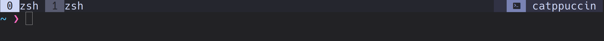
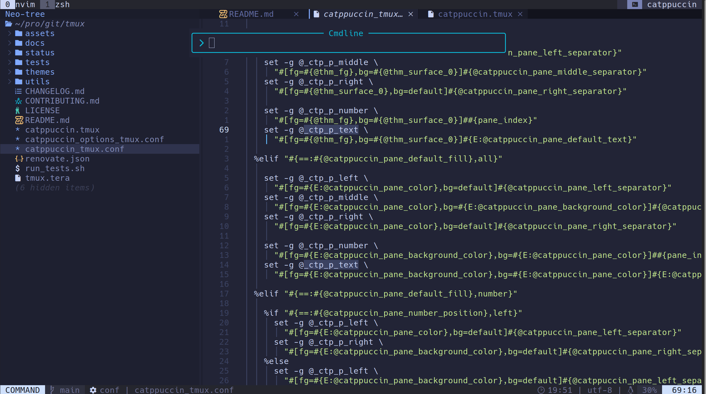

<!-- markdownlint-disable -->

# 🚧 Catppuccin Fork WIP

This is personalized `catppuccin-mocha` theme.
The purpose is to better fit a specific `nvim` + `tmux` combo.

## Local Preview

### Terminal

  

### With Neovim

  

## 📝 ToDo

- [ ] change test cases with the new changes.
- [ ] Further test changes with fresh tmux setup.

<!-- markdownlint-enable -->

## 📥 Installation

For more information follow and support the [catppuccin/tmux](https://github.com/catppuccin/tmux).
